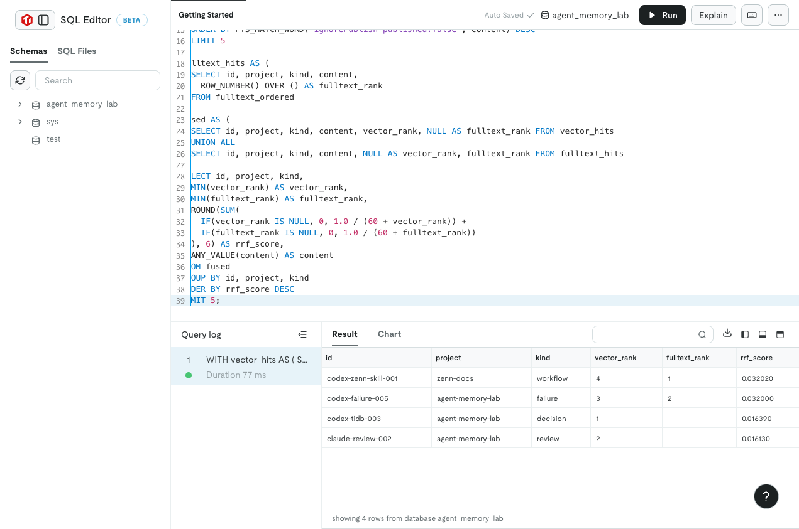
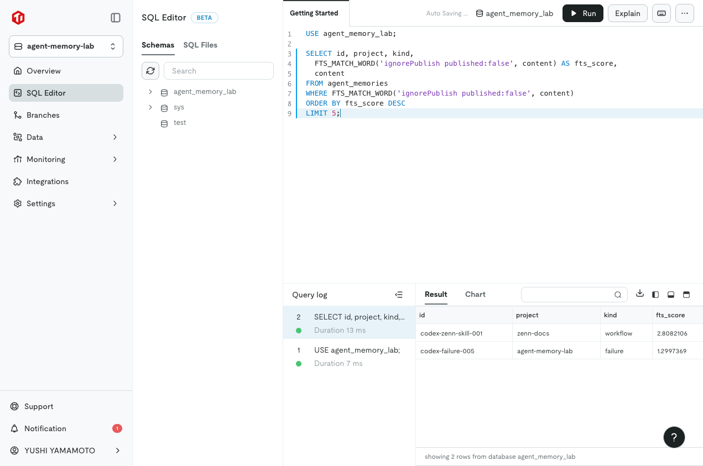
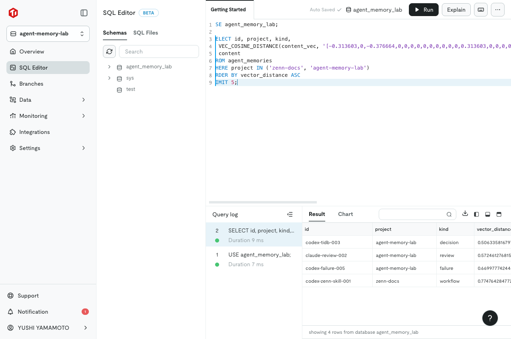

# agent-memory-lab

TiDB Cloud を使って、Codex と Claude Code をまたぐ Agent Memory を検証するための小さな実装です。

狙いは Zennfes Spring 2026 の TiDB テーマ向けに、単なる RAG ではなく「エージェント運用で本当に困る記憶の検索」を再現可能にすることです。

Article:

- https://zenn.dev/yushiyamamoto/articles/tidb-agent-memory-lab

## 何を作っているか

- `agent_memories` という 1 テーブルに、記憶本文、メタデータ、ベクトルを保存する
- TiDB Cloud の `VECTOR(64)` と `VEC_COSINE_DISTANCE()` で意味検索する
- TiDB Cloud の `FULLTEXT INDEX ... WITH PARSER MULTILINGUAL` と `FTS_MATCH_WORD()` で固有名詞やコマンド名を拾う
- ベクトル検索と全文検索の候補を Reciprocal Rank Fusion で統合する
- TiDB 接続情報がない状態でも、同じ考え方をローカル検索でテストできる

## TiDB Cloud

この作業で作成したインスタンス:

- Name: `agent-memory-lab`
- Plan: Starter
- Region: `Singapore (ap-southeast-1)`
- Monthly spending limit: `$0`

Singapore を選んだ理由は、TiDB の全文検索が現在対応している TiDB Cloud Serverless リージョンに含まれるためです。

## セットアップ

```bash
npm install
cp .env.example .env
```

`.env` には TiDB Cloud の `Connect` 画面で確認した値を入れます。パスワードはリポジトリに保存しません。

## ローカル検証

```bash
npm test
npm run typecheck
npm run build
npm run search -- --store local "ignorePublish published:false"
```

## TiDB 検証

```bash
npm run doctor -- --store tidb
npm run seed -- --store tidb --sample
npm run search -- --store tidb "Claude Code の検索で ignorePublish を落としたくない" --project agent-memory-lab
```

DB パスワードをまだ生成しない場合は、TiDB Cloud の SQL Editor に貼り付ける SQL を出力できます。

```bash
npm run search -- --store local "ignorePublish published:false"
npm run --silent sql-editor > /tmp/agent-memory-lab.sql
npm run --silent rrf-sql > /tmp/agent-memory-lab-rrf.sql
```

## 実行証拠

TiDB Cloud SQL Editor で、全文検索、ベクトル検索、RRF 統合を実行した結果です。

### RRF で統合した最終結果



### 全文検索



### ベクトル検索


