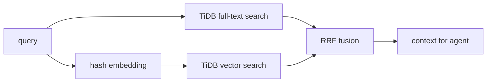

# Architecture

## Goal

Codex と Claude Code の作業記憶を、セッションやツールをまたいで検索できる最小構成にする。

重要なのは「チャットログ全文を RAG する」ことではなく、次のような運用上の記憶を落とさないこと。

- このリポジトリでは production deploy の前に preview URL を確認する
- Zenn 下書きは `published:false` のまま扱う
- Qiita では `ignorePublish: true` をローカルに残す
- TiDB Cloud の検証は Singapore リージョンを使う

## Data Model

```sql
CREATE TABLE agent_memories (
  id VARCHAR(128) PRIMARY KEY,
  source VARCHAR(64) NOT NULL,
  agent VARCHAR(64) NOT NULL,
  project VARCHAR(255) NOT NULL,
  kind VARCHAR(64) NOT NULL,
  content TEXT NOT NULL,
  content_vec VECTOR(64) NOT NULL,
  metadata JSON,
  created_at TIMESTAMP DEFAULT CURRENT_TIMESTAMP,
  updated_at TIMESTAMP DEFAULT CURRENT_TIMESTAMP ON UPDATE CURRENT_TIMESTAMP,
  FULLTEXT INDEX ft_agent_memories_content (content) WITH PARSER MULTILINGUAL
);
```

`source` と `agent` は、Codex、Claude Code、人間メモを同じ表に入れたうえで、必要に応じて SQL で絞り込むために分けている。

## Retrieval Flow



## Why Hybrid Search

ベクトル検索は意味の近さに強い一方、`ignorePublish` や `TIDB_SSL_CA` のような正確なトークンを検索したいときに弱い。

全文検索は固有名詞や日本語キーワードに強い一方、「公開前の人間確認」と「publish gate」のような言い換えは拾いにくい。

そのため、この記事ではどちらか片方の優劣ではなく、同じ TiDB Cloud 上で両方を統合する設計を主題にする。
